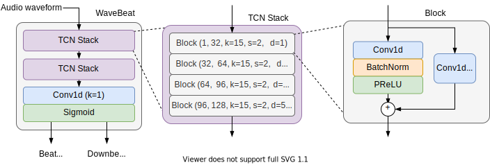

<div  align="center">

# WaveBeat

End-to-end beat and downbeat tracking in the time domain.

| [Paper](docs/resources/AES_151___WaveBeat__End_to_end_beat_and_downbeat_tracking_in_the_time_domain.pdf) | [Code](https://github.com/csteinmetz1/wavebeat) | [Video](https://youtu.be/rHSvRQOlric) |

</div>

<div align="center">

</div>

## Setup

First clone the repo.
```
git clone https://github.com/csteinmetz1/wavebeat.git
cd wavebeat
```

Setup a virtual environment and activate it.
This requires that you use Python 3.8.
```
python3 -m venv env/
source env/bin/activate
```
Next install numpy, cython, and aiohttp first, manually.
```
pip install numpy cython aiohttp
```
Then install the `wavebeat` module.
```
python setup.py install
```

This will ensure that `madmom` installs properly, as it 
currently fails unless cython, numpy, and aiohttp are installed first. 

## Predicting beats

To begin you will first need to download the pre-trained model [here](https://zenodo.org/record/5525120).
Place it in the [`checkpoints/`](checkpoints/) directory, rename to get the `.ckpt` file.

```
cd checkpoints
wget https://zenodo.org/record/5525120/files/wavebeat_epoch%3D98-step%3D24749.ckpt?download=1
mv wavebeat_epoch=98-step=24749.ckpt?download=1 wavebeat_epoch=98-step=24749.ckpt
```

### Functional interface

If you would like to use the functional interface you can create a script and import `wavebeat` as follows.

```python
from wavebeat.tracker import beatTracker

beat, downbeats = beatTracker('audio.wav')
```

### Script interface

We provide a simple script interface to load an audio file and predict the beat and downbeat locations with a pre-trained model. 
Run the model by providing a path to an audio file.

```
python predict.py path_to_audio.wav
```

## Evaluation

In order to run the training and evaluation code you will additionally need
to install all of the development requirements. 
```
pip install -r requirements.txt
```

To recreate our reported results you will first need to have access to the datasets. 
See the paper for details on where to find them. 

Use the command below to run the evaluation on GPU. 
```
python simple_test.py \
--logdir mdoels/wavebeatv1/ \
--ballroom_audio_dir /path/to/BallroomData \
--ballroom_annot_dir /path/to/BallroomAnnotations \
--beatles_audio_dir /path/to/The_Beatles \
--beatles_annot_dir /path/to/The_Beatles_Annotations/beat/The_Beatles \
--hainsworth_audio_dir /path/to/hainsworth/wavs \
--hainsworth_annot_dir /path/to/hainsworth/beat \
--rwc_popular_audio_dir /path/to/rwc_popular/audio \
--rwc_popular_annot_dir /path/to/rwc_popular/beat \
--gtzan_audio_dir /path/to/gtzan/ \
--gtzan_annot_dir /path/to/GTZAN-Rhythm/jams \
--smc_audio_dir /path/to/SMC_MIREX/SMC_MIREX_Audio \
--smc_annot_dir /path/to/SMC_MIREX/SMC_MIREX_Annotations_05_08_2014 \
--num_workers 8 \
```

## Training 

To train the model with the same hyperparameters as those used in the paper, 
assuming the datasets are available, run the following command. 

```
python train.py \
--ballroom_audio_dir /path/to/BallroomData \
--ballroom_annot_dir /path/to/BallroomAnnotations \
--beatles_audio_dir /path/to/The_Beatles \
--beatles_annot_dir /path/to/The_Beatles_Annotations/beat/The_Beatles \
--hainsworth_audio_dir /path/to/hainsworth/wavs \
--hainsworth_annot_dir /path/to/hainsworth/beat \
--rwc_popular_audio_dir /path/to/rwc_popular/audio \
--rwc_popular_annot_dir /path/to/rwc_popular/beat \
--gpus 1 \
--preload \
--precision 16 \
--patience 10 \
--train_length 2097152 \
--eval_length 2097152 \
--model_type dstcn \
--act_type PReLU \
--norm_type BatchNorm \
--channel_width 32 \
--channel_growth 32 \
--augment \
--batch_size 16 \
--lr 1e-3 \
--gradient_clip_val 4.0 \
--audio_sample_rate 22050 \
--num_workers 24 \
--max_epochs 100 \
```

## Cite
If you use this code in your work please consider citing us.

```
@inproceedings{steinmetz2021wavebeat,
    title={{WaveBeat}: End-to-end beat and downbeat tracking in the time domain},
    author={Steinmetz, Christian J. and Reiss, Joshua D.},
    booktitle={151st AES Convention},
    year={2021}}
```