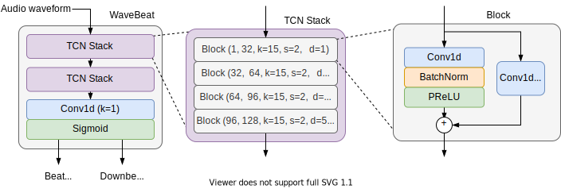

<div  align="center">

# WaveBeat

End-to-end beating tracking with temporal convolutional networks.

| [Paper](docs/end_to_end_beat_tracking_with_temporal_convolutional_networks.pdf) |

</div>

<div align="center">

</div>

## Setup

Setup a virtual environment and activate it.
```
python3 -m venv env/
source env/bin/activate
```
Next install numpy and cython first, manually.
```
pip install numpy cython
```
Then install the packages.
```
pip install -r requirements.txt
```

This will ensure that `madmom` installs properly, as it 
currently fails unless cython and numpy as installed first. 

## Predicting beats

We provide a simple interface to load an audio file and predict the beat and downbeat locations with a pre-trained model. 
To begin you will first need to download the pre-trained model [here](https://drive.google.com/file/d/1q8RaF_ScLRiKgMpOYlY3YqNYT8xCL3TO/view?usp=sharing).
Place it in the [`checkpoints/`](checkpoints/) directory, and extract the `.zip` file.
Then run the model by providing a path to an audio file.

```
python predict.py path_to_audio.wav
```

## Evaluation

To recreate our reported results you will first need to have access to the datasets. 
See the paper for details on where to find them. 

Use the command below to run the evaluation on GPU. 
```
python simple_test.py \
--logdir mdoels/wavebeatv1/ \
--ballroom_audio_dir /path/to/BallroomData \
--ballroom_annot_dir /path/to/BallroomAnnotations \
--beatles_audio_dir /path/to/The_Beatles \
--beatles_annot_dir /path/to/The_Beatles_Annotations/beat/The_Beatles \
--hainsworth_audio_dir /path/to/hainsworth/wavs \
--hainsworth_annot_dir /path/to/hainsworth/beat \
--rwc_popular_audio_dir /path/to/rwc_popular/audio \
--rwc_popular_annot_dir /path/to/rwc_popular/beat \
--gtzan_audio_dir /path/to/gtzan/ \
--gtzan_annot_dir /path/to/GTZAN-Rhythm/jams \
--smc_audio_dir /path/to/SMC_MIREX/SMC_MIREX_Audio \
--smc_annot_dir /path/to/SMC_MIREX/SMC_MIREX_Annotations_05_08_2014 \
--num_workers 8 \
```

## Training 

To train the model with the same hyperparameters as those used in the paper, 
assuming the datasets are available, run the following command. 

```
python train.py \
--ballroom_audio_dir /path/to/BallroomData \
--ballroom_annot_dir /path/to/BallroomAnnotations \
--beatles_audio_dir /path/to/The_Beatles \
--beatles_annot_dir /path/to/The_Beatles_Annotations/beat/The_Beatles \
--hainsworth_audio_dir /path/to/hainsworth/wavs \
--hainsworth_annot_dir /path/to/hainsworth/beat \
--rwc_popular_audio_dir /path/to/rwc_popular/audio \
--rwc_popular_annot_dir /path/to/rwc_popular/beat \
--gpus 1 \
--preload \
--precision 16 \
--patience 10 \
--train_length 2097152 \
--eval_length 2097152 \
--model_type dstcn \
--act_type PReLU \
--norm_type BatchNorm \
--channel_width 32 \
--channel_growth 32 \
--augment \
--batch_size 16 \
--lr 1e-3 \
--gradient_clip_val 4.0 \
--audio_sample_rate 22050 \
--num_workers 24 \
--max_epochs 100 \
```